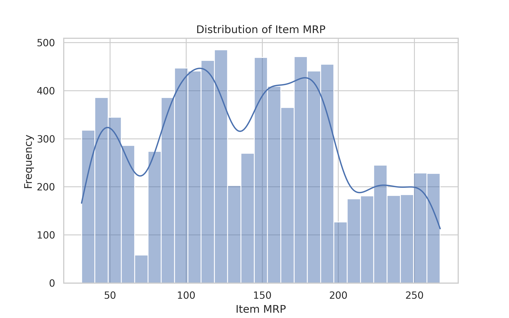
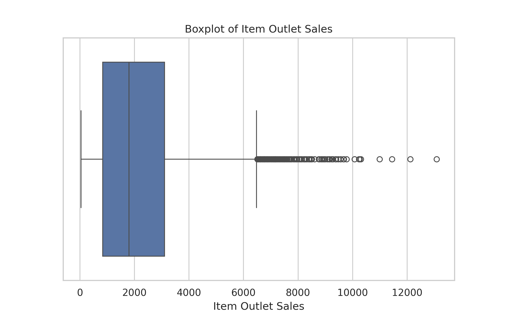
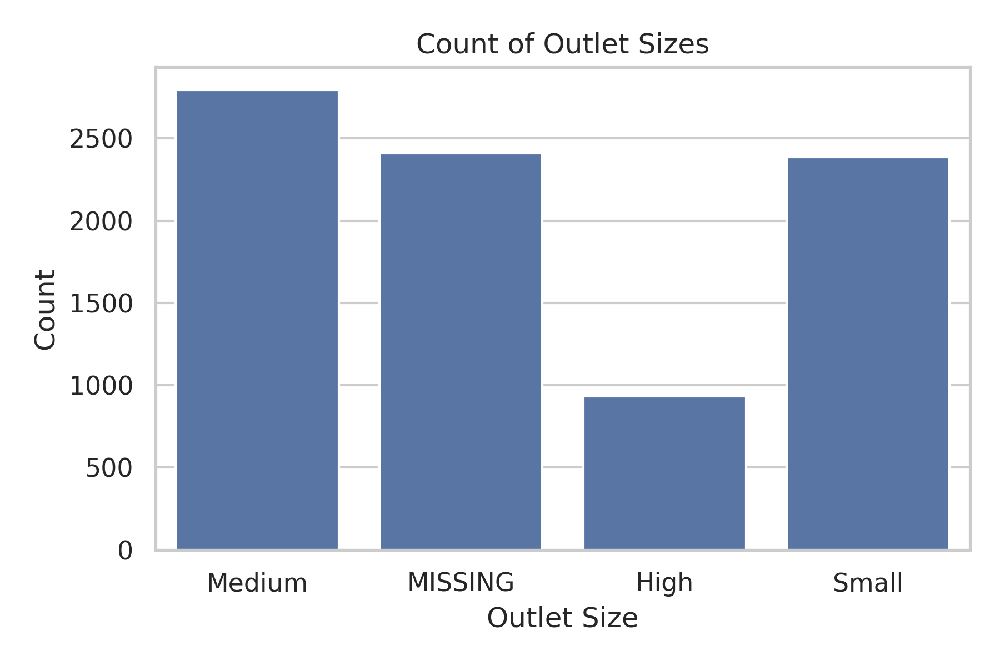
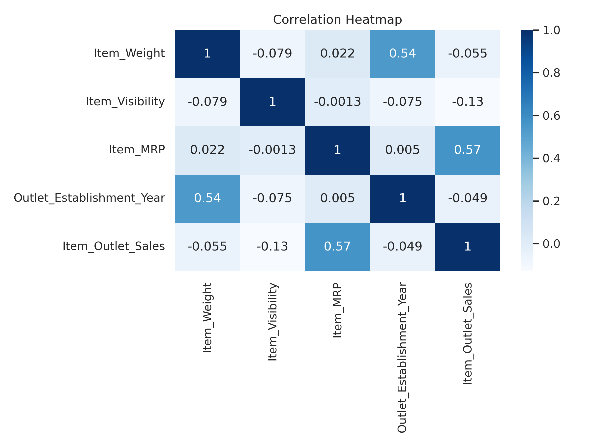
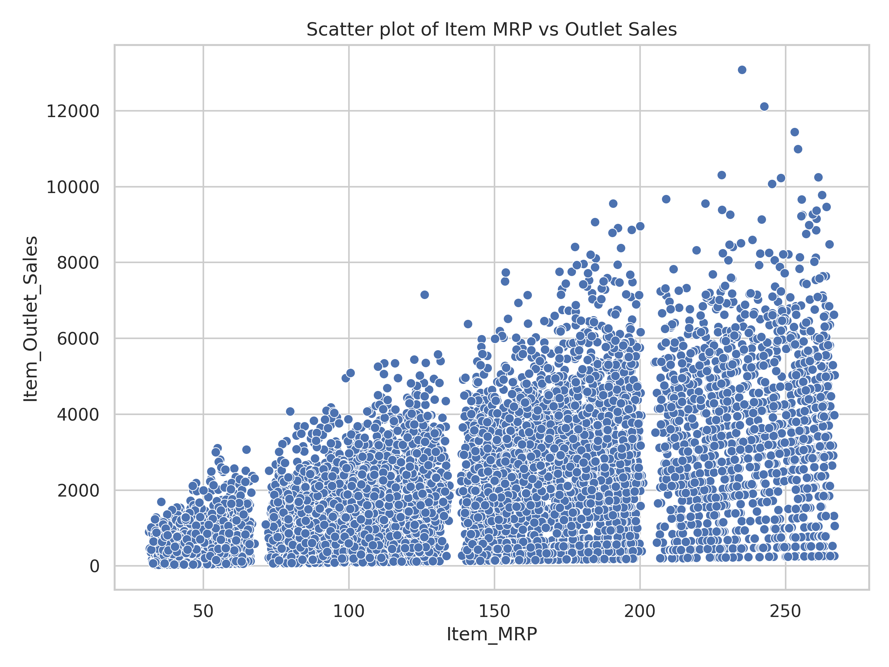

# Boost Retail Sales with Predictive Modeling  
## Analyzing product and outlet features to improve sales forecasts  

**Author:** Mohammed Al Madhoun  

---

### Business problem:

Retailers struggle to balance inventory and sales across multiple outlets, leading to overstock or lost sales. The business problem is to accurately predict product sales at various retail outlets to optimize inventory management and increase profitability.

---

### Data:

- Dataset source: Retail sales data (e.g., BigMart Sales dataset)  
- Number of observations: 8,523 rows  
- Features include: Product attributes (price, category, visibility), outlet information (type, size, location), and sales figures.

---

## Methods

- Data cleaning: Handled missing values for outlet size and product weight to maintain data integrity.  
- Feature engineering: Created combined categories and encoded categorical variables for modeling.  
- Exploratory Data Analysis (EDA): Visualized distributions and correlations to identify key factors influencing sales.  
- Modeling: Built and compared two models — Linear Regression and Random Forest Regressor.

---
   

## Visualizations

### 1. Distribution of Item MRP
This histogram illustrates the distribution of `Item_MRP` (Maximum Retail Price). Most items in the dataset fall within a moderate price range, with fewer items being either very cheap or expensive. Understanding this distribution can help in pricing strategy and sales predictions.

### 2. Boxplot of Item Outlet Sales
The boxplot of `Item_Outlet_Sales` highlights the spread of sales data, identifying a few outliers where some stores have significantly higher or lower sales compared to the majority. These outliers could be key drivers for further analysis.

### 3. Count of Outlet Sizes
This countplot shows the distribution of `Outlet_Size`, indicating that most outlets are either small or medium-sized, with only a few large outlets. This could influence the sales predictions for different types of outlets.

### 4. Correlation Heatmap
The heatmap reveals the correlation between numerical features in the dataset. `Item_MRP` and `Item_Outlet_Sales` show a strong positive correlation, suggesting that higher-priced items tend to generate higher sales. This is valuable for building a predictive model.

### 5. Scatter Plot of Item MRP vs Outlet Sales
This scatter plot visualizes the relationship between Item_MRP and Item_Outlet_Sales. The triangular shape shows that as item prices increase, there's a tendency for higher sales values. This supports the positive correlation seen in the heatmap.

---

## Model Performance

### 1. Linear Regression

| Dataset        | MAE    | MSE          | RMSE    | R²    |
|----------------|--------|--------------|---------|-------|
| Training Data  | 847.13 | 1,297,557.06 | 1,139.10| 0.562 |
| Test Data      | 804.13 | 1,194,409.34 | 1,092.89| 0.567 |

### 2. Random Forest Regression

| Dataset        | MAE    | MSE          | RMSE    | R²    |
|----------------|--------|--------------|---------|-------|
| Training Data  | 640.64 | 820,232.55   | 905.67  | 0.723 |
| Test Data      | 737.13 | 1,123,247.95 | 1,059.83| 0.593 |

**Interpretation:**  
Random Forest outperforms Linear Regression in training and testing datasets, showing higher accuracy (higher R²) and lower errors (MAE, RMSE). This indicates Random Forest better captures complex relationships in the data, making it more suitable for sales prediction.

---
### 3. Linear Regression Model - Coefficient Analysis

Our Linear Regression model helps us understand the direct impact of various features on the target variable. The coefficients indicate the change in the target variable for a one-unit change in the feature, holding other features constant.

Below is the plot showing the top 15 largest coefficients from our Linear Regression model:

*Replace `linear_regression_coefficients.png` with the actual path to your image file.*

**Interpretation of Coefficients:**

The top 3 most impactful features based on their coefficients are:

1.  **`cat_Outlet_Type_Supermarket Type3`** with a coefficient of **1529.768**:
    *   **Simple Explanation:** This means that outlets categorized as "Supermarket Type3" have a very large positive impact on the predicted variable (likely sales or a similar metric). In other words, if an outlet is of this type, it is expected to perform significantly better compared to other types, increasing the target variable by 1529.768 units.

2.  **`cat_Outlet_Identifier_OUT027`** with a coefficient of **1529.768**:
    *   **Simple Explanation:** This indicates that the specific outlet identified as "OUT027" also has a very large positive impact on the target variable, almost identical to "Supermarket Type3". This means this particular outlet contributes significantly to increasing the predicted variable by 1529.768 units.

3.  **`cat_Outlet_Type_Supermarket Type1`** with a coefficient of **1289.576**:
    *   **Simple Explanation:** This feature suggests that outlets of "Supermarket Type1" have a strong positive impact on the target variable, though slightly less than "Supermarket Type3" and "OUT027". If an outlet is of this type, the target variable is expected to increase by 1289.576 units.

In general, large positive coefficients indicate that these features contribute significantly to increasing the predicted value, while negative coefficients suggest they decrease the predicted value.

### 4. Tree-Based Model - Feature Importance (Permutation Importance)

For our tree-based model (e.g., Random Forest, Gradient Boosting), we used Permutation Importance to assess how much each feature contributes to the model's overall performance. A higher importance score indicates a more influential feature.

Here is the plot showing the top 10 features by Permutation Importance:

*Replace `permutation_importance.png` with the actual path to your image file.*

**Interpretation of Feature Importance:**

The top 3 most impactful features based on Permutation Importance are:

1.  **`num_Item_MRP`**:
    *   **Explanation:** This is clearly the most important feature. It indicates that the Maximum Retail Price (MRP) of an item has the largest impact on the variable the model is trying to predict. If the value of `num_Item_MRP` changes, the model's prediction is expected to change significantly. This means the item's price is the strongest factor in determining the outcome.

2.  **`cat_Outlet_Type_Supermarket Type1`**:
    *   **Explanation:** This is the second most important feature. It suggests that the "Supermarket Type1" outlet type has a substantial impact on the model's performance. This means that an outlet being of this specific type significantly influences the target variable, making it a key factor to consider.

3.  **`cat_Outlet_Type_Supermarket Type3`**:
    *   **Explanation:** This is the third most important feature. It indicates that the "Supermarket Type3" outlet type also has a significant impact on the model's performance, though slightly less than "Supermarket Type1". This means this type of outlet plays an important role in determining the predicted outcome.

In summary, this chart shows that the item's price (MRP) is the most influential factor, followed by the outlet type, with "Supermarket Type1" and "Supermarket Type3" being among the most important outlet types affecting the results.

---

## Recommendations:

- Use Random Forest model predictions to optimize stock levels per outlet, reducing waste and missed sales.  
- Target marketing efforts on high-potential products identified by the model.  
- In future iterations, incorporate temporal and promotional data for improved forecasting.

---

## Limitations & Next Steps

- Models currently do not consider seasonality or external economic variables.  
- Explore more advanced algorithms and additional feature engineering to enhance performance.  
- Deploy model into real-time dashboards or APIs for dynamic decision making.

---

### For further information

For questions or collaboration, please contact **mohammed.azm2020@gmail.com**  

